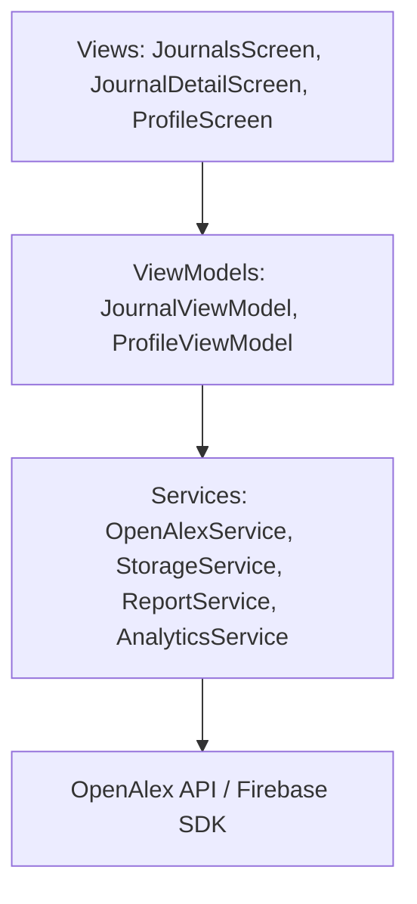

# Implementation Plan - Journals and PDF Export

This plan outlines the design and steps to implement the **`Journals`** and **`PDF Report Export`** modules for the **`Journal Trend Analyzer`** application, fulfilling the functional and technical requirements of Lab 03 for student Dinh.

---

## Approved Design Decisions

> [!IMPORTANT]
> **1. Refactoring the Bottom Navigation Bar to 4 Tabs:**
> The current codebase features a 5-tab Bottom Navigation Bar (Search, Trends, Dashboard, Keywords, Profile). 
> In accordance with the Lab 03 specification, we will refactor it to a **4-tab Bottom Navigation Bar**:
> 1. **Home** (merging Search, Trends, and Dashboard into `HomeScreen`)
> 2. **Journals** (`JournalsScreen`)
> 3. **Keywords** (`KeywordsScreen`)
> 4. **Profile** (`ProfileScreen`)
>
> Once a topic search is executed on the Home screen, it will display the search input at the top, a dashboard cards overview, the publication trend line chart, and the results publications list below.

> [!TIP]
> **2. PDF Download Link Presentation:**
> Upon exporting and uploading the PDF, a success dialog will display the download URL along with **"Copy Link"** (to clipboard) and **"Open in Browser"** (using `url_launcher`) buttons for a premium user experience.

> [!TIP]
> **3. Related Publications in Journal Details:**
> We will query and display the related publications from that journal *associated with the currently active search topic keyword*, making the analytics contextual and meaningful.

> [!WARNING]
> **4. Dependencies to Add:**
> We will add the following packages to `pubspec.yaml`:
> - `pdf: ^3.10.8` (for generating PDF reports in memory)
> - `firebase_storage: ^11.2.0` (for uploading files to Firebase Cloud Storage)

---

## Proposed Changes

We will introduce the new modules across the standard MVVM + Provider architecture.



### 1. Model Layer

#### [NEW] [journal_detail.dart](file:///d:/PRM_CP3/lib/models/journal_detail.dart)
Represents the detailed information of a selected journal, including:
- Journal metadata (id, displayName, publisher, type)
- Total publications, total citations, and average citations per publication
- A list of related `Publication` entities.

### 2. Service Layer

#### [MODIFY] [openalex_service.dart](file:///d:/PRM_CP3/lib/services/openalex_service.dart)
Add a method to query OpenAlex sources and related publications:
- `Future<JournalDetailData> getJournalDetail(String journalId, String keyword)`
  - Query `/sources/{id}` to fetch overall stats (displayName, works_count, cited_by_count).
  - Query `/works?filter=primary_location.source.id:{id}&search={keyword}` to fetch the related publications for the selected topic.

#### [NEW] [report_service.dart](file:///d:/PRM_CP3/lib/services/report_service.dart)
Generates a PDF report document in-memory using the `pdf` package.
- `Future<Uint8List> generatePdfReport(AnalyticsSummary summary, String topic)`
- Formats structured pages showing:
  - Report Title & Metadata (Generation timestamp, topic keyword)
  - Key Statistics (Total Publications, Avg Citations, Peak Year)
  - Details of Top Author, Top Journal, and Most Cited Paper.

#### [NEW] [storage_service.dart](file:///d:/PRM_CP3/lib/services/storage_service.dart)
Uploads PDF bytes to Firebase Cloud Storage.
- `Future<String> uploadPdfReport({required String topic, required Uint8List pdfBytes, required String fileName})`
- Returns the public download URL string upon successful upload.

### 3. ViewModel Layer

#### [NEW] [journal_viewmodel.dart](file:///d:/PRM_CP3/lib/viewmodels/journal_viewmodel.dart)
Manages State for the Journals tab:
- Fields: `isLoading`, `errorMessage`, `isDetailLoading`, `detailErrorMessage`, `topic`, `journals`, `selectedJournalDetail`.
- Methods:
  - `loadForTopic(String topic)`: Fetches top journals using `openAlexService.getTopJournals(topic)` or parses it.
  - `loadJournalDetail(String journalId, String keyword)`: Calls `openAlexService.getJournalDetail(journalId, keyword)`.

#### [NEW] [profile_viewmodel.dart](file:///d:/PRM_CP3/lib/viewmodels/profile_viewmodel.dart)
Manages state for the profile operations, including PDF export and upload status:
- Fields: `isExporting`, `exportError`, `uploadedUrl`.
- Methods:
  - `exportAndUploadReport(AnalyticsSummary summary, String topic)`:
    - Triggers PDF generation via `ReportService`.
    - Uploads the file via `StorageService`.
    - Logs `export_pdf` event via `AnalyticsService`.
    - Updates state with the resulting URL.

#### [MODIFY] [injection_container.dart](file:///d:/PRM_CP3/lib/injection_container.dart)
- Register `JournalViewModel`, `ProfileViewModel` factories.
- Register `StorageService`, `ReportService` singletons.

### 4. View / UI Layer

#### [MODIFY] [main.dart](file:///d:/PRM_CP3/lib/main.dart)
Provide `JournalViewModel` and `ProfileViewModel` inside the `MultiProvider`.

#### [MODIFY] [main_shell.dart](file:///d:/PRM_CP3/lib/widgets/main_shell.dart)
Refactor bottom navigation items to 4 tabs:
- Tab 0: Home (routes to `/home`)
- Tab 1: Journals (routes to `/journals`)
- Tab 2: Keywords (routes to `/keywords`)
- Tab 3: Profile (routes to `/profile`)

#### [MODIFY] [router.dart](file:///d:/PRM_CP3/lib/utils/navigation/router.dart)
- Rename `/search` path to `/home` (routing to merged `HomeScreen`).
- Add `/journals` and `/journal-detail` GoRouter paths.

#### [NEW] [home_screen.dart](file:///d:/PRM_CP3/lib/screens/home_screen.dart)
- Merges the layout from `SearchScreen`, `AnalysisScreen` (Slide 1), and `DashboardScreen`.
- Features search input + quick chips at the top.
- If a topic has been searched, shows the dashboard overview grid, the trend line chart (ecosystem flux), and the publication results list.

#### [NEW] [journals_screen.dart](file:///d:/PRM_CP3/lib/screens/journals_screen.dart)
- Displays top journals for the searched topic ranked by publication count.
- Includes a ranked list of top journals (displaying names, publisher, paper count).
- Includes a bar or pie chart illustrating journal contribution.
- Tapping a journal navigates to the Journal Details page.

#### [NEW] [journal_detail_screen.dart](file:///d:/PRM_CP3/lib/screens/journal_detail_screen.dart)
- Displays journal name, total publications, total citations, and average citations per publication.
- Lists related publications from that journal for the selected topic.
- Tapping a related publication navigates to the existing `DetailScreen`.
- Fires the `view_journal` event with the journal name parameter on load.

#### [MODIFY] [profile_screen.dart](file:///d:/PRM_CP3/lib/screens/profile_screen.dart)
- Wire the "Report Export & Storage" demo card to generate the PDF report, upload it, show progress indicators, and display the resulting download URL.

---

## Verification Plan

### Automated Tests

We will write automated end-to-end integration tests using **Patrol**.

- Create **[journal_flow_test.dart](file:///d:/PRM_CP3/integration_test/journal_flow_test.dart)**:
  - **Test Case 4 – Journals Navigation:** Opens the Journals tab and verifies that top journals list and charts are visible.
  - **Test Case 5 – Journal Details:** Opens a journal detail page, verifies detailed metadata (publications, citations, average), related works, and verifies that `view_journal` analytics event is triggered.
- Create **[export_flow_test.dart](file:///d:/PRM_CP3/integration_test/export_flow_test.dart)**:
  - **Test Case 9 – PDF Export:** Triggers the export report, mocks the storage upload response, verifies successful upload dialog and download link presence, and verifies that `export_pdf` analytics event is logged.

To execute tests:
```powershell
patrol test -t integration_test/journal_flow_test.dart
patrol test -t integration_test/export_flow_test.dart
```

### Manual Verification
1. Launch the application, search for a topic (e.g. *Cybersecurity*).
2. Go to the **`Journals`** tab and check if the ranked list of journals and the charts load correctly.
3. Tap on a journal, check if the Journal Details screen displays total publications, citations, average citations, and related papers correctly. Tap on a paper and ensure it navigates to the details screen.
4. Open the **`Profile`** screen, verify the "Report Export & Storage" card triggers the PDF generation, displays upload progress, and successfully shows the download URL. Verify clicking "Open in Browser" redirects to the page.
5. Inspect the firebase events logs via Firebase DebugView to verify `view_journal` and `export_pdf` are logged with parameters.
